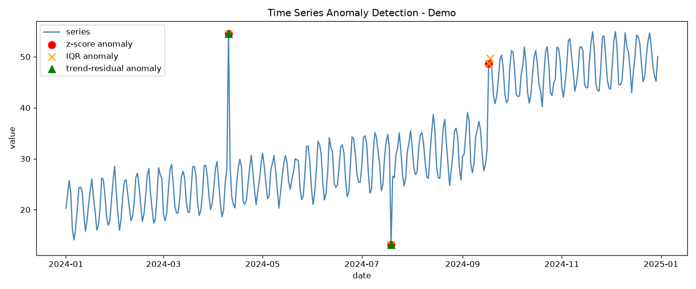
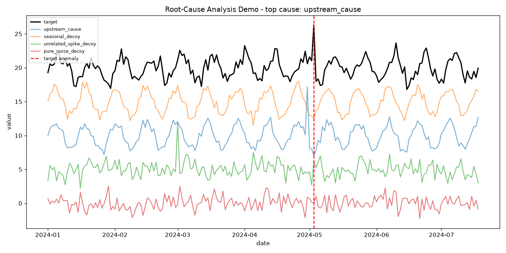
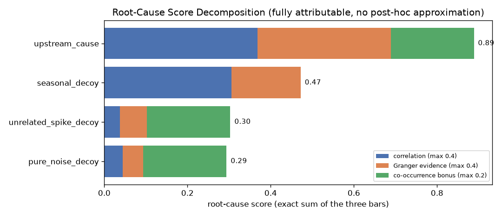
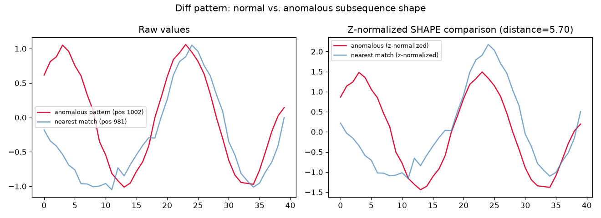
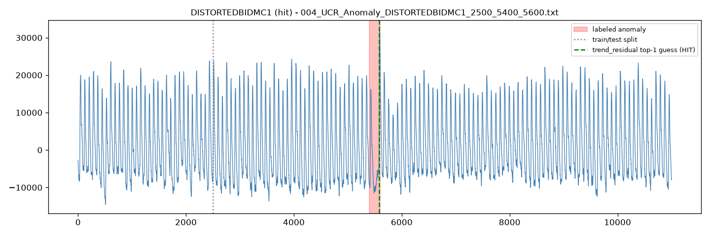
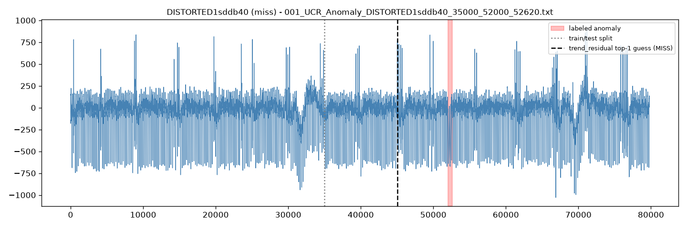
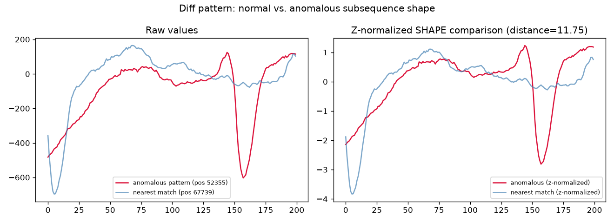

# Time Series Anomaly Detection (from scratch) + Explanations

This project detects anomalies in time series data using simple statistical
methods implemented from scratch (numpy/pandas only), and — just as
importantly — **explains why each flagged point looks anomalous**, instead of
only returning a yes/no flag.

It follows the same "from scratch" spirit as the rest of this repository:
no black-box anomaly-detection libraries, just the underlying math made
explicit and readable.

## Files

| File | Purpose |
|---|---|
| `anomaly_detection.py` | Detectors + point-level explanation logic + a runnable demo |
| `demo_output.png` | Example plot produced by running the anomaly detection demo |
| `root_cause_analysis.py` | Multivariate root-cause ranking + explainability + a runnable demo |
| `root_cause_demo_output.png` | Time series plot from the root-cause demo |
| `root_cause_score_decomposition.png` | Score-attribution chart from the root-cause demo |
| `shape_discord_detection.py` | Shape-based (Matrix Profile / discord) detector + "diff pattern" plots + a runnable demo |
| `shape_discord_demo_pattern.png` | Synthetic shape-only anomaly the point detectors miss entirely |
| `evaluate_ucr.py` | Real-world validation against the UCR Anomaly Archive (all 4 detectors) |
| `ucr_evaluation_results.csv` | Per-file results from the full 250-file UCR run |
| `ucr_example_hit.png` / `ucr_example_miss.png` | Illustrative real-data hit/miss cases (point-based detectors) |
| `ucr_shape_pattern_001.png` | Shape-discord "diff pattern" for the file all point-based detectors missed |
| `LITERATURE_REVIEW.md` | Survey of current TSAD + explainability research (for paper writing) |

Run the demos:

```bash
python3 time_series_anomaly_detection/anomaly_detection.py
python3 time_series_anomaly_detection/root_cause_analysis.py
python3 time_series_anomaly_detection/shape_discord_detection.py
```

## What is a time series anomaly?

A **time series** is a sequence of values ordered in time (e.g. daily sales,
server CPU load, sensor readings). An **anomaly** (or outlier) is a data
point, or short sequence of points, that deviates from the pattern the rest
of the series establishes — trend, seasonality, and typical noise level.

Anomalies are usually grouped into three types:

1. **Point anomaly (spike)** — a single value that is far outside the normal
   range for a single instant, then the series returns to normal.
   *Example: one sensor reading suddenly jumps because of a glitch.*

2. **Contextual anomaly** — a value that isn't extreme in the *global*
   sense, but is unusual *given its context* (e.g. time of day, day of week,
   season). *Example: 2 AM traffic volume equal to rush-hour volume.*

3. **Collective anomaly / level shift** — a sequence of points, or a change
   in the baseline itself, that together looks abnormal even though no
   individual point is extreme. *Example: the series' mean permanently
   jumps to a new level after an event.*

## Why do anomalies occur? (root causes)

Anomalies are symptoms — the interesting question is *what produced them*.
Common real-world causes:

- **Data quality issues**: sensor glitches, missing/duplicated readings,
  logging bugs, unit-conversion errors, clock skew.
- **One-off external events**: a flash sale, a viral post, a power outage,
  a holiday — genuine but rare occurrences, not errors.
- **Regime changes / structural breaks**: a pricing change, a new feature
  launch, a policy change, a system upgrade — the underlying process itself
  changed, so the "new normal" is different from the old one.
- **Increasing/decreasing volatility**: the process becomes less stable
  (e.g. system under increasing load, market uncertainty) even if the
  average level doesn't move much.
- **Fraud / malicious activity**: unusual transaction patterns, intrusion
  attempts — anomalies that are the actual signal of interest.
- **Seasonality mismatch**: a value that's normal for one season/context but
  anomalous in another (a contextual anomaly).

Because the *cause* differs so much by anomaly *shape*, this project doesn't
stop at "is this point anomalous?" — it also classifies *how* the point
deviates (spike vs. level shift vs. volatility change), which is a strong
hint toward the likely cause. See "Explanations" below.

## Detection methods implemented

All three methods work on a rolling/local window so they adapt to trend and
scale, rather than assuming the whole series is stationary.

### 1. Rolling Z-Score (`rolling_zscore_detector`)
For each point, compute the mean and standard deviation of the previous
`window` points, then score how many standard deviations away the current
point is:

```
z = (x_t - rolling_mean) / rolling_std
```

Flag if `|z| > threshold` (default 3, i.e. ~99.7% confidence under a normal
assumption). Simple and fast; sensitive to values that are far from a
*locally stable* mean/std.

### 2. Rolling IQR / Tukey fence (`rolling_iqr_detector`)
For each point, compute Q1 and Q3 of the previous `window` points and flag
values outside `[Q1 - k*IQR, Q3 + k*IQR]` (default `k=1.5`, the classic
boxplot rule). More robust than z-score when the local window itself
already contains outliers, since the median/quartiles aren't dragged around
by extreme values the way mean/std are.

### 3. Trend-Residual Z-Score (`trend_residual_detector`)
First removes a slow-moving baseline (a centred rolling mean, which acts as
a simple trend/seasonality estimate), then applies the rolling z-score to
the **residual**. This avoids false positives on series that have a genuine
trend or seasonal cycle, which a plain z-score can mistake for anomalies.

## Explanations: classifying *why* a point is anomalous

For every flagged point, `_classify_reason()` compares the local window
**before** and **after** the point to decide which shape of anomaly it is:

- If the mean level *before* vs. *after* the point differs by more than
  ~2 local standard deviations and persists → **`level_shift`**
  ("the baseline moved — likely a real regime change").
- Else if the local variance before vs. after changes sharply (more than
  ~2.5x or less than ~0.4x) → **`volatility_change`**
  ("the series got noisier/calmer — likely instability in the source").
- Otherwise → **`spike`**
  ("a one-off point far from its neighbours that reverts right after —
  likely a transient event or bad reading").

Each `Anomaly` returned by a detector carries a human-readable
`explanation` string built from these comparisons (with the actual before/
after means, stds, and the point's value), e.g.:

```
Value 54.50 is a one-off point far above its local neighbourhood
(local mean=24.24, local std=3.50), and the series returns to its
previous baseline right after. Likely cause: a transient event
(e.g. a sensor glitch, a one-time outlier order, a logging error)
rather than a lasting change.
```

This turns a raw "anomaly at index 100" into something a human can act on.

## Example output

Running the demo on a synthetic series (trend + weekly seasonality + 3
injected anomalies: a spike, a dip, and a level shift) correctly recovers
all three and classifies them by type:



## Usage on your own data

```python
import pandas as pd
from anomaly_detection import rolling_zscore_detector, trend_residual_detector

series = pd.read_csv("your_data.csv", index_col="date", parse_dates=True)["value"]

result = trend_residual_detector(series, trend_window=14, z_window=14, threshold=3.0)
print(result.summary())          # DataFrame: timestamp, value, score, kind, explanation
```

## Choosing a method

- Series is roughly flat, no trend/season → **Rolling Z-Score** is simplest.
- Local windows may already contain outliers, or data isn't normally
  distributed → **Rolling IQR** is more robust.
- Series has a clear trend or seasonal cycle (sales, traffic, weather) →
  **Trend-Residual Z-Score** avoids flagging normal seasonal peaks/troughs.

## Root-cause analysis (`root_cause_analysis.py`)

`anomaly_detection.py` classifies *what shape* a deviation has (spike /
level shift / volatility change). It cannot say *which upstream system
caused it* — that requires looking at other, related series. This is the
"conditional/root-cause" gap called out as unsolved in current research
(see `LITERATURE_REVIEW.md` §4, gap #1).

Given a target series with a detected anomaly and a dict of candidate
upstream/related series, `analyze_root_causes()` ranks the candidates by
combining three from-scratch signals:

### 1. Lagged cross-correlation (`best_lagged_correlation`)
Slides each candidate forward by 0..`max_lag` steps and correlates it
against the target. A candidate that **leads** the target by a positive lag
is a much stronger causal hint than one that moves in lockstep (lag 0 —
could just be shared seasonality) or that lags *behind* the target (rules
it out: effects don't precede their causes).

### 2. Granger-causality F-test (`granger_causality_fstat`)
This is the same multi-linear-regression machinery as the rest of this
repo (see the top-level notebook), applied to a causality question instead
of a prediction one:

```
restricted:   y_t = c + Σ a_i · y_(t-i)                       (target's own past only)
unrestricted: y_t = c + Σ a_i · y_(t-i) + Σ b_i · x_(t-i)      (+ candidate's past)
```

Both are fit via ordinary least squares (`np.linalg.lstsq` — the normal
equations, no `statsmodels` dependency). If adding the candidate's lagged
values significantly reduces the residual sum of squares, that's evidence
the candidate **Granger-causes** the target (its past helps predict the
target's future beyond what the target's own history already tells you).
The F-statistic is reported directly; a p-value is added automatically if
`scipy` is installed, but ranking only needs the F-statistic.

### 3. Anomaly co-occurrence
Checks whether the candidate **itself** was flagged as anomalous (reusing
`rolling_zscore_detector` from `anomaly_detection.py`) shortly before the
target's anomaly. A candidate that leads *and* had its own concurrent
anomaly is a triggering event; one that leads without its own anomaly is
more likely an ambient leading indicator.

These three signals combine into one ranking score per candidate, each
with a plain-English explanation, e.g.:

```
'upstream_cause' leads the target by 3 step(s) (correlation=0.92 at lag=3).
Granger-causality F-stat=53.57 (install scipy for a p-value) - its past
values help linearly predict the target beyond the target's own history.
Additionally, it also showed its own detected anomaly shortly before the
target's, which is consistent with it triggering the downstream effect.
```

### Demo

The demo builds a target series driven by a lagged `upstream_cause` series
plus three decoys designed to fool naive (non-lagged) correlation checks —
a `seasonal_decoy` that's correlated only through shared seasonality, an
`unrelated_spike_decoy` with its own anomaly at an unrelated time, and a
`pure_noise_decoy`. `analyze_root_causes` correctly ranks `upstream_cause`
first by a wide margin:



### Usage on your own data

```python
import pandas as pd
from anomaly_detection import rolling_zscore_detector
from root_cause_analysis import analyze_root_causes, summarize, explain_ranking, plot_score_decomposition

target = pd.read_csv("target.csv", index_col="date", parse_dates=True)["value"]
candidates = {
    "upstream_metric_a": pd.read_csv("a.csv", index_col="date", parse_dates=True)["value"],
    "upstream_metric_b": pd.read_csv("b.csv", index_col="date", parse_dates=True)["value"],
}

detection = rolling_zscore_detector(target)
anomaly = max(detection.anomalies, key=lambda a: a.score)
results = analyze_root_causes(target, anomaly.index, candidates, max_lag=10)
print(summarize(results))
print(explain_ranking(results))          # why the top candidate outranked the runner-up
plot_score_decomposition(results, "decomposition.png")
```

## Explainability: an exactly-attributable score, not a post-hoc approximation

The literature review (`LITERATURE_REVIEW.md` §2) notes that the standard
post-hoc XAI tools for anomaly detection — SHAP, LIME — are *approximations*:
they fit a surrogate model around a black box and estimate feature
attributions, which "fall short of specificity" on deep/temporal models.

`root_cause_analysis.py` sidesteps that problem by construction: the score
is a plain weighted sum of three bounded, named terms
(`CORRELATION_WEIGHT=0.4`, `GRANGER_WEIGHT=0.4`, `CO_OCCURRENCE_BONUS=0.2`),
so **every candidate's exact contribution from each signal is available
directly** — `correlation_contribution`, `granger_contribution`, and
`co_occurrence_contribution` on each `RootCauseCandidate` sum to `score`
with no approximation, no surrogate model, and no missing residual.

Three explainability outputs come out of this for free:

1. **Per-candidate score breakdown** — every `explanation` string ends with
   the literal arithmetic (e.g. `0.37 from correlation + 0.32 from Granger
   evidence + 0.20 co-occurrence bonus = 0.89 total`).
2. **Comparative ranking explanation** (`explain_ranking`) — identifies
   *which signal* separated the top candidate from the runner-up, and flags
   a caveat automatically when the runner-up had a co-occurring anomaly and
   the top pick didn't (a case worth a human's second look):

   ```
   Top-ranked root cause: 'upstream_cause' (score=0.89), ahead of
   'seasonal_decoy' (score=0.47) by 0.42. The gap is driven mainly by
   co-occurrence: 'upstream_cause' beat 'seasonal_decoy' by 0.20 on that
   term alone.
   ```
3. **Score decomposition chart** (`plot_score_decomposition`) — a stacked
   bar per candidate showing exactly how much of its score came from each
   signal:

   

This "exact decomposition instead of approximated attribution" property is
also the paper-framing point in `LITERATURE_REVIEW.md` §2.5: it's the
concrete mechanism behind the "lightweight, fully transparent" contrast
with black-box neural RCA (AERCA) and post-hoc-XAI-wrapped deep detectors.

## Shape-based detection: "point extension" (`shape_discord_detection.py`)

Every detector above compares a single **value** against a local rolling
mean/std. That misses an entire class of real anomalies: a subsequence
whose *shape* is wrong even though its value/variance look completely
ordinary (e.g. one distorted heartbeat with the same amplitude range as
every other beat around it).

**Point extension**: instead of asking "is this value far from its
neighbours?", extend the point into a subsequence — a window of length `m`
starting at that point — and ask "does this window's *shape* have a good
match anywhere else in the series?". A subsequence with no good match
anywhere else is a **discord** (Keogh et al.'s term), regardless of what
its raw value looks like.

Computing this requires comparing one candidate window against every other
window in the series. Done naively that's O(n·m) per query; this module
uses **MASS** (Mueen's Algorithm for Similarity Search) to get the full
z-normalized-Euclidean-distance profile in O(n log n) via FFT convolution
(`scipy.signal.fftconvolve`), which is what makes it practical to run on
real 900,000-point series in seconds.

### Demo: an anomaly the point-based detectors cannot see at all

`generate_shape_anomaly_demo()` builds a clean sine wave and distorts the
*frequency* of one cycle (doubles it) without changing its local mean or
standard deviation. Rolling Z-Score flags **zero points** - by value, that
cycle looks completely normal. The shape discord detector finds it exactly:

```
Rolling Z-Score flagged 0 point(s) (true shape anomaly starts at 1000)
Top shape discord: position=1002 (true anomaly at 1000), score=5.70
```

### "Diff patterns": what `plot_pattern_comparison` shows

For any flagged discord, this plots the anomalous subsequence directly
against its nearest-matching subsequence elsewhere in the series - side by
side in raw values, and again z-normalized (mean/std removed from each
independently) so only *shape* is compared:



The right panel is what the algorithm actually scores on: two curves that
should be near-identical if the pattern were normal, diverging sharply
where the anomaly is. The distance in the title is literally the discord
score - the z-normalized Euclidean distance between the two curves.

## Real-world validation: the UCR Anomaly Archive (`evaluate_ucr.py`)

Everything above was validated on synthetic data with known, injected
anomalies - useful for confirming the logic works, but synthetic anomalies
are easy by construction. `evaluate_ucr.py` runs all four detectors -
three point-based (`anomaly_detection.py`) plus the shape-based discord
detector (`shape_discord_detection.py`) - against the **UCR Anomaly
Archive** (Keogh et al.; see Wu & Keogh, *"Current Time Series Anomaly
Detection Benchmarks are Flawed"*, 2021) — 250 real series (ECG,
respiration, gait, air temperature, power demand, insect EPG, MARS rover
telemetry, etc.), each with exactly one labeled anomaly interval. It's one
of the nine benchmarks named across the surveys in `LITERATURE_REVIEW.md`
§1.

The archive is not bundled in this repo (330MB+ across 250 files) - see the
docstring at the top of `evaluate_ucr.py` for the download/unzip commands.

**Evaluation protocol**: rather than point-adjusted F1 (shown to be
gameable — `LITERATURE_REVIEW.md` §3), each detector's single
highest-scoring point in the test region is checked for whether it falls
inside the labeled anomaly interval - a **top-1 hit rate**, the same
protocol this specific archive's own literature uses (e.g. MERLIN, Matrix
Profile discord papers). This can't be inflated by flagging lots of points.

### Results (full 250-file run, all four detectors)

| Detector | Top-1 hit rate |
|---|---|
| Rolling Z-Score | 10.0% (25/250) |
| Rolling IQR | 6.0% (15/250) |
| Trend-Residual Z-Score | 10.8% (27/250) |
| **Shape Discord** | **20.4% (51/250)** |
| Any of the 3 point-based methods agrees | 16.8% (42/250) |
| **Any of all 4 methods agrees** | **31.2% (78/250)** |
| All 4 agree | 1.6% (4/250) |
| *(random-guess baseline)* | *0.84%* |

**Headline result**: adding the shape discord detector nearly doubles the
best single point-based detector's hit rate (20.4% vs. 10.8%), and
combining all four ("any agrees") reaches 31.2% - almost 2x the point-only
ensemble (16.8%). That combined number is the more honest one to quote:
no single method dominates, and the gain comes from *complementarity*, not
from shape discord being categorically better.

**The complementarity, precisely**: of the 250 files,
- **36 were caught *only* by shape discord** — every point-based method
  missed them (mostly ECG, apnea-ECG, InternalBleeding, qtdbSel, gaitHunt
  files: morphology changes invisible to value-based rolling stats).
- **27 were caught *only* by a point-based method** — shape discord missed
  them (e.g. most of `CIMIS`, `GP`, `Lab`, `STAFFIIIDatabase`,
  `CHARISten`: cases where the anomaly *is* closer to a value-level shift
  that the fixed subsequence length `m=100` doesn't resolve well, or where
  a spike genuinely is the simplest description of what happened).
- Only 4 files had all four methods agree.

This is the honest story for a paper: **point-value and shape-based
detection catch structurally different failure modes**, and this dataset
alone won't let you declare a single "winner" — it argues for running both
families and combining their outputs, not for replacing one with the
other. Domain matters a lot too: `apneaecg` jumped from 0% (trend-residual)
to 75% (shape discord); `qtdbSel` went from 0% to 100%; but `STAFFIIIDatabase`
and `CHARISten` went the other way (11%/33% down to 0%) once switching to
shape comparison at a fixed window length.

**Hit example** (`004_UCR_Anomaly_DISTORTEDBIDMC1`, an ECG-like signal) -
the anomaly is a shape distortion in one beat, small enough to be invisible
at a glance, but a strong enough local deviation for the trend-residual
detector to catch exactly:



**Miss example for point-based detectors, hit for shape discord**
(`001_UCR_Anomaly_DISTORTED1sddb40`, also ECG-like) - the labeled anomaly
[52000, 52620] is not visually distinguishable from the rest of the signal
by raw value, and several other points elsewhere in the series look at
least as extreme by rolling mean/std, so all three point-based detectors'
top-1 guesses land far from the true interval:



But comparing *shape* instead of *value* finds it directly: the shape
discord detector's top pick (position 52355) lands inside the true
interval. Its nearest matching pattern anywhere else in the ~80,000-point
series (position 67739) still looks noticeably different once both are
z-normalized — a real structural difference (an extra dip the "normal"
beat doesn't have), not a value-level outlier:



**What this means for the project**: the point-level "why" explanations
and the root-cause ranking are detector-agnostic wrappers - they explain
*whatever* a detector flags, so their usefulness is capped by the
detector's own recall. Shape discord detection closes part of that gap for
morphology-based anomalies, but not all of it (the 27 point-only catches
above), so the honest framing for a paper is: **detector choice should
match anomaly type, and reporting a single-detector number without this
breakdown would be misleading.** This directly corroborates the
"shape-aware methods vs. rolling statistics" gap discussed in
`LITERATURE_REVIEW.md` §1, now backed by a same-benchmark, same-protocol
before/after measurement rather than just citing other papers' claims.

Reproduce: `python3 evaluate_ucr.py path/to/ucr_data` (add an integer to
run on only the first N files for a quick check).

## Limitations

- These are univariate (per-series), unsupervised, threshold-based methods
  — good baselines, not a replacement for domain-tuned or ML-based
  detectors (e.g. Isolation Forest, Prophet, LSTM autoencoders) on complex,
  noisy, multi-seasonal data.
- The `level_shift` / `volatility_change` / `spike` classification is a
  heuristic based on before/after window statistics, not a causal
  inference — it narrows down *what kind* of deviation occurred, and the
  root-cause module above narrows down *which series* is implicated.
- **Correlation and Granger-causality are evidence, not proof of
  causation.** A confounder — some unobserved factor driving both the
  candidate and the target — can produce the exact same lagged-correlation
  and Granger-causality signature as a genuine cause. `analyze_root_causes`
  ranks *plausibility*, not certainty; treat its output as a shortlist for
  human investigation, not a verdict.
- Granger causality is inherently linear and pairwise — it won't detect
  nonlinear causal relationships, and doesn't build a full causal graph
  across many interacting candidates (no handling of one candidate
  mediating another's effect on the target).
- The anomaly co-occurrence check reuses a single detector/threshold; a
  real root-cause pipeline would tune this per candidate series.
